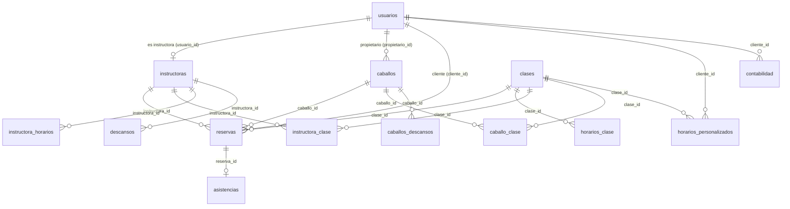

# Base de Datos — country_refugiodb

Sistema de reservas de clases ecuestres para El Refugio Country Club.

## Conexión

| Parámetro | Valor |
|-----------|-------|
| Host | `212.227.238.213` |
| Puerto | `3306` |
| Base de datos | `country_refugiodb` |
| Usuario dev | `dev_user` |
| Charset | `utf8mb4` |
| Timezone del pool | `'Z'` (UTC) — las fechas en BD están en UTC; Cancún es UTC-5/UTC-6 |

> **Atención:** Las funciones `CURDATE()` y `NOW()` en consultas SQL devuelven tiempo UTC, no hora local de Cancún. Tomar en cuenta al filtrar por fecha actual.

---

## Diagrama Entidad-Relación



---

## Tablas

### `usuarios`
Tabla central de usuarios del sistema: clientes, instructoras, admins y creadores de cuentas.

| Columna | Tipo | Nullable | Default | Notas |
|---------|------|----------|---------|-------|
| `id` | INT AUTO_INCREMENT | NO | — | PK |
| `username` | VARCHAR(50) | NO | — | UNIQUE |
| `nombre` | VARCHAR(100) | SÍ | NULL | |
| `apellido` | VARCHAR(100) | SÍ | NULL | |
| `edad` | INT | SÍ | NULL | |
| `correo` | VARCHAR(100) | SÍ | NULL | |
| `telefono` | VARCHAR(20) | SÍ | NULL | |
| `contrasena` | VARCHAR(255) | SÍ | NULL | Hash bcrypt |
| `rol` | ENUM | SÍ | `'cliente'` | `administrador`, `instructora`, `cliente`, `creadorcuentas` |
| `tipo_cliente` | ENUM | SÍ | NULL | `propietario`, `demo`, `general`, `renta`, `media_renta` |
| `nivel` | VARCHAR(50) | SÍ | NULL | Campo legacy (ver `tipo_nivel`) |
| `tipo_nivel` | ENUM | SÍ | NULL | `paseo`, `iniciacion`, `intermedio`, `avanzado`, `ponyclub` |
| `estatus` | ENUM | SÍ | `'activo'` | `activo`, `inactivo`, `bloqueado` |
| `fecha_registro` | DATETIME | SÍ | `CURRENT_TIMESTAMP` | |
| `dia_corte` | INT | SÍ | `1` | Día del mes para corte de pago (1–28) |
| `ultimo_pago` | DATE | SÍ | NULL | Última fecha de pago registrada |
| `proxima_alerta` | DATE | SÍ | NULL | Fecha sugerida para recordatorio de pago |

**Índices:** `idx_usuarios_dia_corte (dia_corte)`

---

### `instructoras`
Perfil de instructora, siempre vinculado a un registro en `usuarios`.

| Columna | Tipo | Nullable | Default | Notas |
|---------|------|----------|---------|-------|
| `id` | INT AUTO_INCREMENT | NO | — | PK |
| `usuario_id` | INT | SÍ | NULL | FK → `usuarios.id` |
| `nombre` | VARCHAR(100) | SÍ | NULL | |
| `apellido` | VARCHAR(100) | SÍ | NULL | |
| `num_contacto` | VARCHAR(20) | SÍ | NULL | |
| `especialidad` | VARCHAR(100) | SÍ | `''` | p.ej. `mixto`, `salto` |
| `disponibilidad` | ENUM | SÍ | `'disponible'` | `disponible`, `descanso`, `no_disponible` |
| `fecha_registro` | DATETIME | SÍ | `CURRENT_TIMESTAMP` | |

> Solo se consideran disponibles las instructoras con `disponibilidad = 'disponible'`.

---

### `clases`
Tipos de clase ofrecidos. Determinan la duración, capacidad y nivel requerido.

| Columna | Tipo | Nullable | Default | Notas |
|---------|------|----------|---------|-------|
| `id` | INT AUTO_INCREMENT | NO | — | PK |
| `nombre` | ENUM | SÍ | NULL | `iniciacion`, `intermedio`, `avanzado`, `paseo`, `ponyclub` |
| `duracion_min` | INT | SÍ | NULL | Duración en minutos |
| `cupo_max` | INT | SÍ | NULL | Capacidad máxima total (referencia general) |
| `prioridad` | INT | SÍ | `0` | Prioridad de asignación |
| `horario_matutino` | TIME | SÍ | NULL | Horario AM de referencia (columna legacy) |
| `horario_vespertino` | TIME | SÍ | NULL | Horario PM de referencia (columna legacy) |
| `observaciones` | TEXT | SÍ | NULL | |

**Datos actuales:**

| id | nombre | duracion_min |
|----|--------|-------------|
| 1 | iniciacion | 30 |
| 2 | intermedio | 60 |
| 3 | paseo | 60 |
| 4 | avanzado | 60 |
| 5 | ponyclub | 30 |

> La capacidad real por slot se controla en `horarios_clase.capacidad`, no en `clases.cupo_max`.

---

### `caballos`
Caballos disponibles en el club. Pueden ser del club (`publico`) o de propietarios.

| Columna | Tipo | Nullable | Default | Notas |
|---------|------|----------|---------|-------|
| `id` | INT AUTO_INCREMENT | NO | — | PK |
| `nombre` | VARCHAR(100) | SÍ | NULL | |
| `propietario_id` | INT | SÍ | NULL | FK → `usuarios.id` ON DELETE SET NULL |
| `disponibilidad` | ENUM | SÍ | `'disponible'` | `disponible`, `no_disponible` |
| `estatus` | ENUM | SÍ | `'publico'` | `publico`, `privado`, `renta`, `media_renta` |
| `especialidad` | VARCHAR(255) | SÍ | `'mixto'` | |
| `descripcion` | TEXT | SÍ | NULL | |
| `fecha_registro` | DATETIME | SÍ | `CURRENT_TIMESTAMP` | |
| `veces_usado_semana` | INT | NO | `0` | Contador de usos en la semana actual |
| `semana_inicio` | DATE | SÍ | NULL | Inicio del período semanal activo |

**Índices:** `idx_caballos_uso_semana`, `idx_caballos_especialidad`, `idx_caballos_disponibilidad`, `idx_caballos_estatus`

> `veces_usado_semana` se reinicia automáticamente cuando la fecha actual supera `semana_inicio + 7 días`.

---

### `reservas`
Tabla central. Cada fila es una reserva de un cliente para una clase en una fecha/hora específica.

| Columna | Tipo | Nullable | Default | Notas |
|---------|------|----------|---------|-------|
| `id` | INT AUTO_INCREMENT | NO | — | PK |
| `cliente_id` | INT | SÍ | NULL | FK → `usuarios.id` |
| `caballo_id` | INT | SÍ | NULL | FK → `caballos.id` ON DELETE SET NULL |
| `instructora_id` | INT | SÍ | NULL | FK → `instructoras.id` ON DELETE SET NULL |
| `clase_id` | INT | SÍ | NULL | FK → `clases.id` ON DELETE SET NULL |
| `fecha` | DATE | SÍ | NULL | Fecha de la clase |
| `hora_inicio` | TIME | SÍ | NULL | Hora de inicio |
| `hora_fin` | TIME | SÍ | NULL | Hora de fin |
| `estatus` | ENUM | SÍ | `'pendiente'` | `pendiente`, `confirmada`, `cancelada`, `completada`, `cancelada_instructor` |
| `tipo` | ENUM | SÍ | `'normal'` | `normal`, `propietario`, `renta`, `media_renta` |
| `observaciones` | TEXT | SÍ | NULL | |
| `motivo_cancelacion` | TEXT | SÍ | NULL | Solo si fue cancelada |
| `created_at` | DATETIME | SÍ | `CURRENT_TIMESTAMP` | |

**Índices:** `idx_reservas_fecha`, `idx_reservas_fecha_estatus`, `idx_reservas_caballo_fecha`, `idx_reservas_fecha_horas`, `idx_reservas_instructora_fecha`

---

### `horarios_clase`
Define los slots de horario disponibles por clase y día de la semana. Es la fuente de verdad para qué clases existen en qué horarios.

| Columna | Tipo | Nullable | Default | Notas |
|---------|------|----------|---------|-------|
| `id` | INT AUTO_INCREMENT | NO | — | PK |
| `clase_id` | INT | NO | — | FK → `clases.id` |
| `dia_semana` | ENUM | NO | — | `L`, `M`, `X`, `J`, `V`, `S`, `D` |
| `hora_inicio` | TIME | NO | — | |
| `hora_fin` | TIME | NO | — | |
| `capacidad` | INT | NO | `1` | Cupos disponibles en este slot |
| `activo` | TINYINT(1) | NO | `1` | `1` = activo, `0` = inactivo |

**Unique:** `(clase_id, dia_semana, hora_inicio, hora_fin)`

**Horarios de fin de semana por nivel:**
- `iniciacion` y `paseo`: tienen múltiples slots S/D
- `intermedio` (id=2): solo `10:00–11:00` en S/D (más `08:00` añadido en migración 009)
- `avanzado` (id=4): solo `10:00–11:00` en S/D (más `08:00` añadido en migración 009)
- `ponyclub` (id=5): sigue el mismo patrón que `iniciacion`

---

### `instructora_clase`
Tabla de permisos: qué clases puede impartir cada instructora.

| Columna | Tipo | Nullable | Default | Notas |
|---------|------|----------|---------|-------|
| `id` | INT AUTO_INCREMENT | NO | — | PK |
| `instructora_id` | INT | NO | — | FK → `instructoras.id` |
| `clase_id` | INT | NO | — | FK → `clases.id` |
| `activo` | TINYINT(1) | NO | `1` | Solo las filas con `activo=1` cuentan |
| `restricciones` | VARCHAR(255) | SÍ | NULL | p.ej. `solo_sabados`, `solo_mananas` (actualmente no se aplica en código) |
| `creado_en` | TIMESTAMP | NO | `CURRENT_TIMESTAMP` | |

**Unique:** `(instructora_id, clase_id)`

> Si una instructora no tiene fila activa en esta tabla para una clase, NO aparece como candidata para esa clase.

---

### `instructora_horarios`
Ventanas de disponibilidad horaria de cada instructora por día. Si una instructora **no tiene filas** en esta tabla, se considera disponible en cualquier horario.

| Columna | Tipo | Nullable | Default | Notas |
|---------|------|----------|---------|-------|
| `id` | INT AUTO_INCREMENT | NO | — | PK |
| `instructora_id` | INT | NO | — | FK → `instructoras.id` ON DELETE CASCADE |
| `dia_semana` | ENUM | NO | — | `L`, `M`, `X`, `J`, `V`, `S`, `D` |
| `hora_inicio` | TIME | NO | — | |
| `hora_fin` | TIME | NO | — | |
| `activo` | TINYINT(1) | NO | `1` | |
| `creado_en` | TIMESTAMP | NO | `CURRENT_TIMESTAMP` | |

**Unique:** `(instructora_id, dia_semana, hora_inicio, hora_fin)`

> Esta tabla tiene ~93 filas que fueron insertadas directamente en producción (no en migraciones). El instructor JESUS (id=18) tiene ventanas restrictivas aquí.

---

### `descansos`
Días de descanso o ausencia de instructoras. Pueden ser específicos (rango de fechas) o recurrentes (día fijo de la semana).

| Columna | Tipo | Nullable | Default | Notas |
|---------|------|----------|---------|-------|
| `id` | INT AUTO_INCREMENT | NO | — | PK |
| `instructora_id` | INT | NO | — | FK → `instructoras.id` ON DELETE CASCADE |
| `fecha_inicio` | DATE | SÍ | NULL | NULL si es descanso recurrente |
| `fecha_fin` | DATE | SÍ | NULL | NULL si es descanso recurrente |
| `motivo` | VARCHAR(255) | SÍ | NULL | |
| `tipo` | ENUM | SÍ | `'otro'` | `personal`, `enfermedad`, `vacaciones`, `otro` |
| `aprobado_por` | INT | SÍ | NULL | FK → `usuarios.id` |
| `fecha_creacion` | DATETIME | SÍ | `CURRENT_TIMESTAMP` | |
| `dia_semana` | ENUM | SÍ | NULL | Solo para recurrentes: `L`, `M`, `X`, `J`, `V`, `S`, `D` |
| `es_recurrente` | TINYINT(1) | NO | `0` | `1` = descanso fijo semanal |
| `limite_reservas` | INT | SÍ | NULL | Si se alcanza este límite, el descanso deja de bloquear |
| `reservas_realizadas` | INT | NO | `0` | Contador de reservas hechas durante este descanso |

> Cuando `reservas_realizadas >= limite_reservas`, el descanso se ignora en la lógica de disponibilidad.

---

### `horarios_personalizados`
Horarios fijos asignados a clientes específicos (p.ej. propietarios con clase a hora fija).

| Columna | Tipo | Nullable | Default | Notas |
|---------|------|----------|---------|-------|
| `id` | INT AUTO_INCREMENT | NO | — | PK |
| `cliente_id` | INT | NO | — | FK → `usuarios.id` ON DELETE CASCADE |
| `instructora_id` | INT | NO | — | FK → `instructoras.id` ON DELETE CASCADE |
| `clase_id` | INT | NO | — | FK → `clases.id` ON DELETE CASCADE |
| `tipo` | ENUM | NO | `'fecha_especifica'` | `fecha_especifica`, `recurrente` |
| `fecha` | DATE | SÍ | NULL | Solo si `tipo = 'fecha_especifica'` |
| `dia_semana` | ENUM | SÍ | NULL | Solo si `tipo = 'recurrente'`: `L`…`D` |
| `hora_inicio` | TIME | NO | — | |
| `hora_fin` | TIME | NO | — | |
| `activo` | TINYINT(1) | NO | `1` | |
| `creado_en` | TIMESTAMP | NO | `CURRENT_TIMESTAMP` | |

**Índice:** `idx_hp_busqueda (cliente_id, activo, tipo, fecha, dia_semana)`

---

### `caballos_descansos`
Períodos de descanso o baja de un caballo (lesión, etc.).

| Columna | Tipo | Nullable | Default | Notas |
|---------|------|----------|---------|-------|
| `id` | INT AUTO_INCREMENT | NO | — | PK |
| `caballo_id` | INT | NO | — | FK → `caballos.id` |
| `fecha_inicio` | DATE | NO | — | |
| `fecha_fin` | DATE | SÍ | NULL | NULL = sin fecha de fin definida |
| `motivo` | VARCHAR(255) | SÍ | NULL | |
| `activo` | TINYINT(1) | NO | `1` | |

**Índices:** `idx_descanso_caballo_activo (caballo_id, activo)`, `idx_descanso_fechas (fecha_inicio, fecha_fin)`

---

### `caballo_clase`
Tabla de compatibilidad: qué caballos pueden usarse en qué tipo de clase.

| Columna | Tipo | Nullable | Default | Notas |
|---------|------|----------|---------|-------|
| `id` | INT AUTO_INCREMENT | NO | — | PK |
| `caballo_id` | INT | SÍ | NULL | FK → `caballos.id` ON DELETE CASCADE |
| `clase_id` | INT | SÍ | NULL | FK → `clases.id` ON DELETE CASCADE |

---

### `asistencias`
Registro de asistencia por reserva. Se crea al marcar una reserva como completada.

| Columna | Tipo | Nullable | Default | Notas |
|---------|------|----------|---------|-------|
| `id` | INT AUTO_INCREMENT | NO | — | PK |
| `reserva_id` | INT | NO | — | FK → `reservas.id` |
| `instructora_id` | INT | NO | — | FK → `instructoras.id` |
| `asistio` | ENUM | NO | `'presente'` | `presente`, `ausente`, `justificado` |
| `nivel_clase` | ENUM | SÍ | NULL | `paseo`, `iniciacion`, `intermedio`, `avanzado`, `ponyclub` — nivel del alumno al momento |
| `registrado_en` | TIMESTAMP | NO | `CURRENT_TIMESTAMP` | |

**Índices:** `idx_asistencia_instructora`, `idx_asistencia_reserva`

---

### `contabilidad`
Registro de pagos y estados de cuenta de los clientes.

| Columna | Tipo | Nullable | Default | Notas |
|---------|------|----------|---------|-------|
| `id` | INT AUTO_INCREMENT | NO | — | PK |
| `cliente_id` | INT | SÍ | NULL | FK → `usuarios.id` |
| `fecha_pago` | DATE | SÍ | NULL | |
| `monto` | DECIMAL(10,2) | SÍ | `0.00` | |
| `concepto` | VARCHAR(255) | SÍ | NULL | |
| `estatus_pago` | ENUM | SÍ | `'pendiente'` | `pendiente`, `pagado`, `vencido`, `bloqueado` |
| `metodo_pago` | ENUM | SÍ | `'efectivo'` | `efectivo`, `transferencia`, `link_pago` |
| `observaciones` | TEXT | SÍ | NULL | |
| `fecha_registro` | DATETIME | SÍ | `CURRENT_TIMESTAMP` | |

---

### `notificaciones`
Sistema de notificaciones internas para usuarios.

> Tabla presente en el backup; no hay migraciones explícitas para su esquema. Consultar `backup_refugiodb.sql` para el DDL completo.

---

## Flujo de Booking

Cuando el cliente intenta reservar (`POST /reservas/book`), el backend sigue este pipeline:

```
1. Validar que el slot existe en horarios_clase (clase_id + dia_semana + hora_inicio)
   └─ Si no existe → error

2. Contar reservas existentes en ese slot (para ese cliente si tiene horario personalizado,
   o para el slot general)
   └─ Si capacidad llena → error

3. Determinar instructoras candidatas:
   a. instructora_clase: solo las con activo=1 para esa clase
   b. instructora_horarios: si tiene filas, verificar que el slot caiga dentro de su ventana
      (si NO tiene filas → disponible todo el día)
   c. descansos: excluir si tiene descanso ese día/fecha
      (excepto si limite_reservas fue alcanzado → descanso se ignora)
   d. instructoras.disponibilidad = 'disponible'

4. Seleccionar instructora (lógica anti-scarcity):
   - Si la clase es especializada (ej. avanzado) y hay pocas instructoras,
     priorizar las más disponibles para evitar monopolizar un recurso escaso

5. Asignar caballo disponible:
   - disponibilidad = 'disponible'
   - No tenga caballos_descansos activos para esa fecha
   - Compatible según caballo_clase (si aplica)
   - Respetar veces_usado_semana

6. Insertar en reservas con estatus='pendiente' o 'confirmada'
```

---

## Reglas de Negocio Importantes

| Regla | Detalle |
|-------|---------|
| **instructora_horarios vacía = siempre disponible** | Si una instructora no tiene filas en `instructora_horarios`, el backend la trata como disponible en cualquier horario |
| **Capacidad por slot** | La capacidad real se lee de `horarios_clase.capacidad`, NO de `clases.cupo_max` |
| **Descansos con límite** | Un `descanso` deja de bloquear cuando `reservas_realizadas >= limite_reservas` |
| **`instructora_clase.activo`** | Solo las filas con `activo=1` habilitan a una instructora para una clase |
| **Timezone UTC** | El pool conecta con `timezone: 'Z'`. Cancún = UTC-5 (CST) / UTC-6 (CDT). Cuidado con `CURDATE()` cerca de medianoche |
| **`instructoras.disponibilidad`** | Tres estados: `disponible`, `descanso`, `no_disponible`. Solo `disponible` pasa el filtro |
| **Límite semanal de caballos** | `caballos.veces_usado_semana` + `semana_inicio` controlan cuántas veces se usa un caballo por semana |
| **`restricciones` no se aplica** | La columna `instructora_clase.restricciones` (p.ej. `solo_sabados`) existe en BD pero el código actual no la evalúa |

---

## Historial de Migraciones

| Archivo | Qué hace |
|---------|----------|
| `002_modelo_datos_core.sql` | Crea `horarios_clase`, `caballos_descansos`, `asistencias`, `instructora_clase`; agrega columnas `dia_corte`, `ultimo_pago`, `proxima_alerta` a `usuarios` y uso semanal a `caballos` |
| `003_datos_iniciales.sql` | Siembra datos iniciales: 4 clases, slots de horario para todas las clases, 3 instructoras (Briggite, Isabela, Jimmy) y sus permisos por clase |
| `004_actualizar_horarios_paseo.sql` | Actualiza/añade ~70 slots de horario para clase `paseo` (L–V 8AM–12PM y 4–6PM; S–D 8AM–12PM) |
| `005_descansos_fijos_recurrentes.sql` | Agrega columnas `dia_semana`, `es_recurrente`, `limite_reservas`, `reservas_realizadas` a `descansos` |
| `006_instructora_horarios.sql` | Crea tabla `instructora_horarios` (sin datos — los ~93 registros fueron insertados directo a producción) |
| `007_horarios_personalizados.sql` | Crea tabla `horarios_personalizados` |
| `008_agregar_ponyclub.sql` | Agrega `ponyclub` a los ENUMs de `clases`, `asistencias` y `usuarios`; inserta slots de horario para ponyclub |
| `009_agregar_horarios_intermedio_avanzado.sql` | Agrega slots `16:00–17:00` L–V y `08:00–09:00` S–D para `intermedio` (clase_id=2) y `avanzado` (clase_id=4) |
| `add_metodo_pago_to_contabilidad.sql` | Agrega columna `metodo_pago` a `contabilidad` |
| `add_nivel_clase_to_asistencias.sql` | Agrega columna `nivel_clase` a `asistencias` |

---

*Archivo generado: 2026-05-04 — Fuente: `backup_refugiodb.sql` + migraciones en `Backend/migrations/`*
